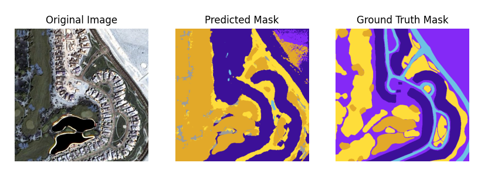

# UNet Semantic Image Segmentation for Aerial Imagery of Dubai

## Overview

This repository contains the implementation of UNet for Semantic Segmentation of Aerial Images, classifying land, water, buildings, roads, and vegetation. The code includes training and inference scripts to generate semantic maps of input images. This repository is built for educational purposes on the implementation of UNet and its application in real-world scenarios.

## Results

Here are some sample results from the UNet model:

<p align="center">
  
</p>

Due to the complex nature of the dataset, the segmentation model could not correctly identify geographical features that were either too small or under-represented. However, it is interesting to note that that geographical features with large surface areas and appear frequently, the model is able to segment such instances to a reasonable degree. It might be beneifical to incorporate self-attention mechanisms for finer semantic segmentation as well as incorporating patch-based segementation but this is out of the scope of the repository.

## Installation

1. Clone the repository:
    ```bash
    git clone https://github.com/CodeKnight314/UNet-Image-Segmentation.git
    ```

2. Create and activate a virtual environment (optional but recommended):
    ```bash
    python -m venv unet-env
    source unet-env/bin/activate
    ```

3. cd to project directory: 
    ```bash 
    cd UNet-Image-Segmentation/
    ```

4. Install the required packages:
    ```bash
    pip install -r requirements.txt
    ```

## Preprocess data: 

1. Download Aerial Image Dataset: 
    ```bash
    kaggle datasets download -d humansintheloop/semantic-segmentation-of-aerial-imagery
    ```

2. Unzip the zip file: 
    ```bash
    unzip semantic-segmentation-of-aerial-imagery
    ```

3. run preprocess_data.py: 
    ```bash
    python3 preprocess_data.py --input_dir Semantic\ segmentation\ of\ aerial\ imagery/ --patch --patch_size 256 --stride 128
    ```

4. move classes.json into UNetData/